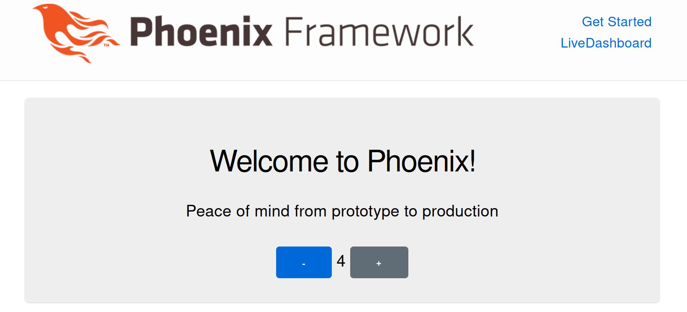

- `assets/build.js`

```javascript {linenos=true,linenostart=1}
const esbuild = require('esbuild')

const args = process.argv.slice(2)
const watch = args.includes('--watch')
const deploy = args.includes('--deploy')

let opts = {
    entryPoints: ['js/app.js'],
    bundle: true,
    target: 'es2017',
    outdir: '../priv/static/assets',
    logLevel: 'info',
    loader:  {
        '.ttf': 'file',
        '.svg': 'file',
    },
    plugins: [ ]
}

if (watch) {
    opts = {
        ...opts,
        watch,
        sourcemap: 'inline'
    }
}

if (deploy) {
    opts = {
        ...opts,
        minify: true
    }
}

const promise = esbuild.build(opts)

if (watch) {
    promise.then(_result => {
        process.stdin.on('close', () => {
            process.exit(0)
        })

        process.stdin.resume()
    })
}

```

- `assets/package.json`

```json {linenos=true,linenostart=1}
{
  "dependencies": {
    "lit": "^2.4.0",
    "phoenix": "file:../deps/phoenix",
    "phoenix_html": "file:../deps/phoenix_html",
    "phoenix_live_view": "file:../deps/phoenix_live_view",
    "phoenix-custom-event-hook": "^0.0.5"
  },
  "devDependencies": {
    "esbuild": "^0.15.12"
  }
}

```

### Update configs

Update of the file `config/config.exs`:

```diff
# FILE: config/config.exs
--- config :esbuild,
---   version: "0.14.29",
---   default: [
---     args:
---       ~w(js/app.js --bundle --target=es2017 --outdir=../priv/static/assets --external:/fonts/* --external:/images/*),
---     cd: Path.expand("../assets", __DIR__),
---     env: %{"NODE_PATH" => Path.expand("../deps", __DIR__)}
---   ]
+++ config :esbuild,
+++       version: "0.15.12"
```

Update of the file `config/dev.exs`.

Final look:

```elixir {linenos=true,linenostart=17}
# FILE: config/dev.exs
# ...
config :my_sandbox, MySandboxWeb.Endpoint,
  # Binding to loopback ipv4 address prevents access from other machines.
  # Change to `ip: {0, 0, 0, 0}` to allow access from other machines.
  http: [ip: {127, 0, 0, 1}, port: 4000],
  check_origin: false,
  code_reloader: true,
  debug_errors: true,
  secret_key_base: "+Qsxj...",
  watchers: [
    # Start the esbuild watcher by calling `cd assets && node build.js --watch`
    node: ["build.js", "--watch", cd: Path.expand("../assets", __DIR__)]
  ]
# ...
```

```diff
--- # Start the esbuild watcher by calling Esbuild.install_and_run(:default, args)
--- esbuild: {Esbuild, :install_and_run, [:default, ~w(--sourcemap=inline --watch)]}
+++ node: ["build.js", "--watch", cd: Path.expand("../assets", __DIR__)]
```

### Update `mix.exs`

Now let's update _**aliases**_ section in `mix.exs` file.

1. We have to handle our newly added npm depencies during the setup stage.
   To do this is simply add `cmd --cd assets npm install` to the **setup** alias.

```elixir {linenos=false}
"cmd --cd assets npm install"
```

2. Next step is to fix production build.
   Replace the default `esbuild` command by launching our `build.js` config script
   for the **asset.deploy** alias.

```elixir {linenos=false}
"cmd --cd assets node build.js --deploy"
```

Final look of the `mix.exs`:

```elixir {linenos=true,linenostart=59}
# FILE: mix.exs
# ...
  defp aliases do
    [
      setup: ["deps.get", "ecto.setup", "cmd --cd assets npm install"],
      "ecto.setup": ["ecto.create", "ecto.migrate", "run priv/repo/seeds.exs"],
      "ecto.reset": ["ecto.drop", "ecto.setup"],
      test: ["ecto.create --quiet", "ecto.migrate --quiet", "test"],
      "assets.deploy": ["cmd --cd assets node build.js --deploy", "phx.digest"]
    ]
  end
# ...
```

Detailed diff for `mix.exs`:

```diff {linenos=false}
--- setup: ["deps.get", "ecto.setup"],
+++ setup: ["deps.get", "ecto.setup", "cmd --cd assets npm install"],
```

```diff {linenos=false}
--- "assets.deploy": ["esbuild default --minify", "phx.digest"],
+++ "assets.deploy": ["cmd --cd assets node build.js --deploy", "phx.digest"]
```

### Create your first web-component

`assets/js/my-counter.js`

```javascript {linenos=true,linenostart=1}
// FILE: assets/js/my-counter.js
import {html, LitElement} from "lit";

export class MyCounter extends LitElement {
    static properties = {
        count: {type: Number},
    };

    constructor() {
        super();
        this.count = 0;
    }

    inc() {
        this.count++;
    }

    dec() {
        this.count--;
    }

    render() {
        return html`
            <link phx-track-static="" rel="stylesheet" href="/assets/app.css">
            <button class="btn btn-icon-only btn-primary btn-sm" @click="${this.dec}">-</button>
            <span>${this.count}</span>
            <button class="btn btn-icon-only btn-primary btn-sm" @click="${this.inc}">+</button>
        `;
    }
}

customElements.define("my-counter", MyCounter);

```


```javascript {linenos=true,linenostart=20}
// FILE: assets/js/app.js
// ... 
// Include phoenix_html to handle method=PUT/DELETE in forms and buttons.
import "phoenix_html"
// Establish Phoenix Socket and LiveView configuration.
import {Socket} from "phoenix"
import {LiveSocket} from "phoenix_live_view"
import topbar from "../vendor/topbar"

// Import newly created custom web-component
import "./my-counter" 

```

Put to the index.html.heex
`<my-counter></my-counter>`

````html
# lib/my_sandbox_web/templates/page/index.html.heex

<section class="phx-hero">
  <h1><%= gettext "Welcome to %{name}!", name: "Phoenix" %></h1>
  <p>Peace of mind from prototype to production</p>
  
  <!-- custom web-component   -->
  <my-counter></my-counter>
</section>


````

